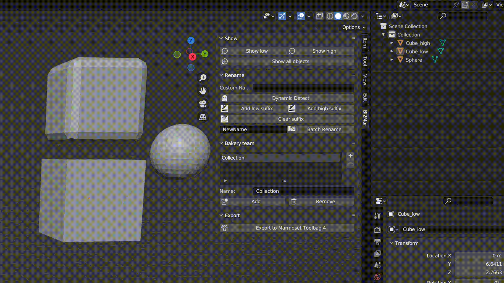

# BlToMar
**BlToMar - Blender To MarmosetToolbag4 Plugin** is a plugin that exports Blender to MarmosetToolbag4 and provides some convenient operations in blender  
You can also get it from Gumroad : [BlToMar——Blender To MarmosetToolbag4 Plugin](https://s1778773436.gumroad.com/l/fgvxi)

## Function
* Rename: Quickly add suffixes/dynamically detect names/batch rename
* Show: Show/Hide objects with different suffixes
* Baking group: Quick Baking group
* Export: One-click export to MarmosetToolbag4

## How to Use
* **Add/Clear suffixes**  

  

After clicking the dynamic detection, the object clicked by the mouse will be dynamically detected. If the object name with low is double-clicked, the name will be automatically added to the Custom Name Column  

   

It is recommended to open dynamic detect, name the '_low' object, and then click the object that you want to add '_high', directly click the Add high suffix button, so that you can avoid manually entering the name for a second time  

  

* **Batch Rename**  

  

* **Displays objects with different suffixes**  

* **Add/Delete/Name scene collection**

  

Select group, select any low/high object, and click the Add button to automatically add the same named object to the group  

  

Select group, select any low/high object, and click the Remove button to automatically remove the same named object to the group  

* **Export**

Specify the path to Marmoset Toolbag4 in the plugins panel, then save the Blend file and click Export to export automatically  

    
